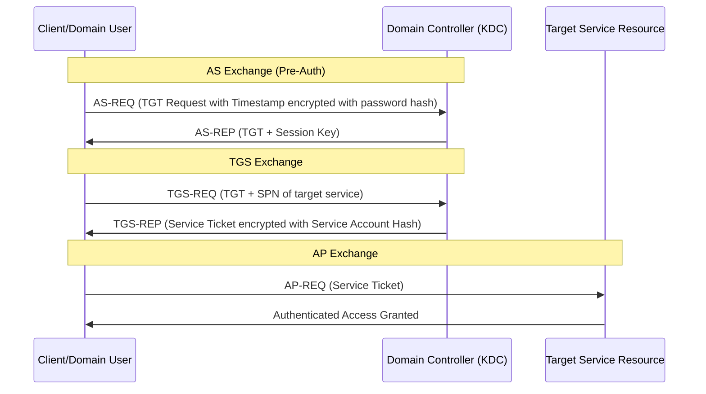

# 08. Red Team Tradecraft, Infrastructure & Detection Engineering

This section covers the theoretical mechanics of Red Team infrastructure design, stealthy reconnaissance, Active Directory (AD) Pentesting & Red Teaming concepts, and the corresponding defensive telemetry used by Blue Teams to detect and mitigate these activities.

---

## Table of Contents
- [Tiered Infrastructure Architecture (C2 Design)](#tiered-infrastructure-architecture-c2-design)
  - [Defensive Analysis: JARM & JA3/JA4 Fingerprinting](#defensive-analysis-jarm--ja3ja4-fingerprinting)
- [External Active Directory & Tenant Profiling](#external-active-directory--tenant-profiling)
  - [Defensive Analysis: Monitoring Tenant Footprints](#defensive-analysis-monitoring-tenant-footprints)
- [Active Directory Pentesting & Red Teaming Theory](#active-directory-pentesting--red-teaming-theory)
  - [AD Architecture & Trust Topologies](#ad-architecture--trust-topologies)
  - [LDAP Enumeration Mechanics](#ldap-enumeration-mechanics)
    - [Defensive Telemetry: LDAP Auditing (Event ID 1644)](#defensive-telemetry-ldap-auditing-event-id-1644)
  - [Kerberos Authentication Attacks](#kerberos-authentication-attacks)
    - [1. AS-REP Roasting (Pre-Authentication Bypass)](#1-as-rep-roasting-pre-authentication-bypass)
    - [2. Kerberoasting (Service Principal Abuse)](#2-kerberoasting-service-principal-abuse)
    - [Defensive Telemetry: Kerberos Logging (Event IDs 4768 & 4769)](#defensive-telemetry-kerberos-logging-event-ids-4768--4769)
  - [Privilege Escalation & Delegation Abuse](#privilege-escalation--delegation-abuse)
    - [1. Unconstrained Delegation](#1-unconstrained-delegation)
    - [2. Constrained Delegation & S4U Extensions](#2-constrained-delegation--s4u-extensions)
    - [Defensive Remediation: Hardening Delegation](#defensive-remediation-hardening-delegation)
- [Defense Evasion in Network Reconnaissance](#defense-evasion-in-network-reconnaissance)
  - [Defensive Analysis: Beaconing & Scan Detection](#defensive-analysis-beaconing--scan-detection)
- [Edge Device & Initial Access Profiling](#edge-device--initial-access-profiling)
  - [Defensive Analysis: Perimeter Hardening & Threat Telemetry](#defensive-analysis-perimeter-hardening--threat-telemetry)

---

## Tiered Infrastructure Architecture (C2 Design)

Modern Red Team operations separate the primary Command & Control (C2) servers from direct interaction with the target network. This is achieved using a tiered proxy model.

```mermaid
graph TD
    Target[Target Network] -->|HTTP/HTTPS Traffic| Redirector[Tier 1 Redirector (CDN / Nginx)]
    Redirector -->|Proxy Forwarding| TeamServer[Tier 2 C2 Team Server]
    TeamServer -->|Administrative Access| Operator[Red Team Operator Console]
    
    style Target fill:#f9f,stroke:#333,stroke-width:2px
    style Redirector fill:#bbf,stroke:#333,stroke-width:2px
    style TeamServer fill:#fbb,stroke:#333,stroke-width:2px
```

### 1. Tier 1: Front-end Redirectors
- **Purpose**: Receive incoming agent beacons or scanning callbacks.
- **Mechanics**: Configured using standard reverse proxies (Nginx, Apache) or Content Delivery Networks (CDNs).
- **Domain Fronting**: An evasion technique where a request is routed through a major CDN provider, masking the true host header. While many CDNs have restricted this, custom configurations (e.g., abusing HTTP Host headers on legacy servers) are still analyzed in academic evasion studies.

### 2. Tier 2: Team Servers
- **Purpose**: Manage agent states, deliver tasking, and compile execution logs.
- **OpSec Rule**: Team servers must never interact with the target directly. Access is restricted exclusively to authorized operator IPs via SSH tunnels or VPNs.

---

### Defensive Analysis: JARM & JA3/JA4 Fingerprinting

Security monitoring systems detect custom redirectors and C2 listeners without analyzing the payloads themselves, by looking at SSL/TLS handshake behaviors.

#### JARM (Active TLS Fingerprinting)
JARM is an active TLS fingerprinting tool. It sends 10 customized TLS Client Hello packets to a target port and analyzes the server responses to compile a 62-character cryptographic fingerprint.
- **Detection**: C2 frameworks (e.g., Cobalt Strike, Sliver) have default JARM signatures. Security tools search Shodan/Censys for these signatures to flag malicious servers.
- **Mitigation**: Red Teams configure Nginx/Apache redirectors to use standard, unmodified TLS stacks (like default Debian Apache configurations) to blend in. Blue Teams monitor inbound traffic to identify mismatching certificates/JARM signatures.

#### JA3/JA4 (Passive TLS Fingerprinting)
JA3/JA4 hashes the parameters of the TLS Client Hello packet sent by the client.
- **Detection**: If a scanner or C2 agent uses a custom TLS library (e.g., Go’s `crypto/tls` or custom Python sockets), its JA3/JA4 fingerprint will differ from standard browsers like Chrome or Edge.
- **Rule Example (Suricata)**:
  ```text
  alert tls $HOME_NET any -> $EXTERNAL_NET any (msg:"MALICIOUS JA3/JA4 SSL Client Fingerprint Detected"; ja3.hash:"[KNOWN_MALICIOUS_HASH]"; sid:1000001; rev:1;)
  ```

---

## External Active Directory & Tenant Profiling

During external reconnaissance, mapping a target’s Identity Provider (IdP) infrastructure reveals active usernames, email structures, and authentication portals.

### 1. Microsoft 365 / Azure AD Tenant Discovery
Microsoft exposes specific endpoints that allow organizations to query domain federation status passively.

- **Mechanics**: Querying the OpenID Configuration or Autodiscover endpoints reveals details about the tenant.
  - Endpoint: `https://login.microsoftonline.com/getuserrealm.aspx?login=user@target.com&xml=1`
  - Response Data:
    - `NameSpaceType`: Identifies whether the domain is `Managed` (handled directly by Azure AD) or `Federated` (redirected to an on-premise ADFS server).
    - `FederationBrandName`: Indicates the primary identity provider domain name.
    - `AuthURL`: The exact URL where users are redirected to authenticate (e.g., ADFS portal).

### 2. Identity Provider Fingerprinting
Organizations routing authentication through external services expose login endpoints:
- **Okta**: `https://target.okta.com`
- **Keepers / Active Directory Federation Services (ADFS)**: `/adfs/ls/idpinitiatedsignon.aspx`
- **PingFederate**: `/pingfederate/`

---

### Defensive Analysis: Monitoring Tenant Footprints

Defenders monitor Azure Active Directory and on-premise Active Directory access to block tenant enumeration and brute-forcing.

- **Mitigation Strategies**:
  - **Tenant Restrictions**: Configure firewall or web gateway rules to restrict outbound M365 access only to approved corporate directory tenants.
  - **Blocking Legacy Authentication**: Disable legacy protocols (e.g., IMAP, POP3, SMTP authentication) that bypass Multi-Factor Authentication (MFA).
- **Log Correlation**: Monitor Azure Active Directory Sign-in Logs (specifically Event ID `4625` on ADFS or failed sign-in status codes like `50053` - Account Locked, `50126` - Invalid Credentials).

---

## Active Directory Pentesting & Red Teaming Theory

Once internal access or initial foot-holding is established, Active Directory becomes the primary target for lateral movement, privilege escalation, and domain dominance.

### AD Architecture & Trust Topologies

An Active Directory Forest consists of one or more Domain Trees, which share a common schema, configuration, and global catalog.
- **Domain Trusts**: Relationships that allow users in one domain to access resources in another.
  - **Transitive Trusts**: If Domain A trusts Domain B, and Domain B trusts Domain C, then Domain A implicitly trusts Domain C.
  - **Non-Transitive Trusts**: A trust relationship restricted strictly to the two participating domains.
  - **Shortcut & Parent-Child Trusts**: Internal trusts created to optimize authentication paths.
  - **External / Forest Trusts**: Created between separate organizations or distinct forests.

---

### LDAP Enumeration Mechanics

Lightweight Directory Access Protocol (LDAP) is the protocol used to query and manage directory objects in AD (Domain Controllers listen on TCP/UDP 389 and 636 for LDAPS).

- **Enumeration Concept**: Standard domain users have default read permissions to almost all AD objects. Operators run LDAP queries programmatically to retrieve:
  - Users, Groups, Computers, and Organisational Units (OUs).
  - Group memberships (e.g., identifying nested members of the `Domain Admins` group).
  - Trust details (using attributes like `trustDirection` and `trustType`).
  - Active Directory Schema metadata.

#### Defensive Telemetry: LDAP Auditing (Event ID 1644)
Domain Controllers can be configured to log LDAP searches that exceed resource limits or query high volumes of objects.
- **Windows Event Log**: `Directory Service` log, Event ID **1644**.
- **Data Logged**: Lists the IP address of the client performing the LDAP query, the exact search filter used, and the number of objects returned.
- **Hardening**: Restrict standard user read DACLs on sensitive AD objects (such as computer accounts or specific OUs) to limit automated mapping tools.

---

### Kerberos Authentication Attacks

Kerberos is the default authentication protocol in Active Directory. It relies on a Key Distribution Center (KDC) running on Domain Controllers (TCP/UDP port 88).



#### 1. AS-REP Roasting (Pre-Authentication Bypass)
- **Vulnerability**: If the attribute `DONT_REQ_PREAUTH` (Do not require Kerberos preauthentication) is set on a user account, anyone can send an `AS-REQ` to the KDC on behalf of that user.
- **Attack Mechanics**: The KDC returns an `AS-REP` containing a ticket encrypted with the target user's password hash. Since no pre-authentication timestamp was validated, this ticket can be extracted from the network capture and cracked offline using dictionary or brute-force attacks.

#### 2. Kerberoasting (Service Principal Abuse)
- **Vulnerability**: Any authenticated domain user can request a Kerberos service ticket (`TGS-REP`) for any Service Principal Name (SPN) registered in the Active Directory forest.
- **Attack Mechanics**: When a client sends a `TGS-REQ` specifying an SPN registered under a user account (service account), the KDC returns a `TGS-REP` ticket encrypted with that service account's password hash. The client extracts this ticket from memory and cracks it offline to recover the service account password.

#### Defensive Telemetry: Kerberos Logging (Event IDs 4768 & 4769)
Domain Controllers log Kerberos ticket requests in the Windows Security Log.

- **Event ID 4768 (Authentication Ticket Requested - AS-REQ)**:
  - **AS-REP Roasting Detection**: Look for Event ID 4768 where Pre-Authentication Type is listed as `0` (or `0x0` - None), indicating pre-authentication was bypassed.
- **Event ID 4769 (Service Ticket Requested - TGS-REQ)**:
  - **Kerberoasting Detection**: Look for abnormal ticket request patterns:
    - High frequency of Event ID 4769 requests from a single source host targeting multiple service names.
    - **Encryption Downgrade**: Monitor for tickets requested with **RC4-HMAC (Type 0x17 / 23)** encryption instead of standard AES-256 (Type 0x12 / 18). Attackers often downgrade encryption because RC4 is significantly faster to crack offline.
  - **Honeytoken Accounts**: Create fake SPNs registered under accounts with highly attractive names (e.g., `SQL-Admin-Service`). Configure SIEM alerts to trigger immediately if an Event ID 4769 is logged targeting these specific honeytoken accounts, as they have no legitimate business function.

---

### Privilege Escalation & Trust Abuse

Once administrative control over local machines or services is obtained, delegation configurations allow operators to impersonate domain users.

#### 1. Unconstrained Delegation
- **Vulnerability**: When a computer or user account is configured with Unconstrained Delegation, it can impersonate any domain user that authenticates to it.
- **Attack Mechanics**: When a user attempts to access a service running on a machine with unconstrained delegation, the domain controller inserts a copy of that user's Ticket Granting Ticket (TGT) into the service ticket. The machine stores the user's TGT in the LSASS (Local Security Authority Subsystem Service) memory. An operator who compromises this machine can extract these cached TGTs from memory to impersonate high-privilege users (e.g., Domain Admins).

#### 2. Constrained Delegation & S4U Extensions
- **Vulnerability**: Constrained Delegation restricts impersonation to specific services (e.g., HTTP/server-1). However, it uses Microsoft Kerberos extensions: **S4U2self** (Service for User to Self) and **S4U2proxy** (Service for User to Proxy).
- **Attack Mechanics**: 
  - **S4U2self**: Allows a service to request a service ticket for itself on behalf of any domain user (without validating their password), provided the service has constrained delegation configured.
  - **S4U2proxy**: Allows the service to present that ticket to the KDC to request an impersonation ticket targeting downstream services. If an operator compromises the account hash of a machine/user with constrained delegation, they can generate custom S4U requests to impersonate Domain Admins to the allowed services.

---

### Defensive Remediation: Hardening Delegation

To prevent delegation abuse, secure Active Directory settings:

1. **Disable Unconstrained Delegation**: Transition all systems to Resource-Based Constrained Delegation (RBCD) or Standard Constrained Delegation.
2. **Protected Users Security Group**: Add high-privilege administrative accounts to the default AD group `Protected Users`. This group enforces strict security policies:
   - Restricts delegation (TGTs cannot be delegated or cached).
   - Disables weak encryption ciphers.
   - Enforces Kerberos authentication (disables NTLM fallbacks).
3. **Sensitive Flag**: Mark administrative accounts as `Account is sensitive and cannot be delegated` in their AD user properties.

---

## Defense Evasion in Network Reconnaissance

Aggressive port scanning triggers immediate alerts on modern Security Information and Event Management (SIEM) systems. Defensive evasion during scanning focuses on minimizing signature detection.

### 1. Time Domain Manipulation (Slow and Low)
Standard scanners send packets in rapid bursts. Evasion relies on extending the delay between packets to prevent threshold-based IDS triggers.
- **Mechanics**: Setting randomized intervals (jitter) between port queries. For example, sending one port probe every 5–10 minutes from a rotating IP network.

### 2. Protocol Blending
- **User-Agent Customization**: Modifying HTTP headers to match the typical software profile of the target organization (e.g., matching the specific browser versions used by corporate employees).
- **TLS Cipher Suite Alignment**: Ensuring that scanning tools utilize the identical cipher ordering and client flags as standard web browsers, avoiding default curl or Python footprints.

---

### Defensive Analysis: Beaconing & Scan Detection

Blue Teams use statistical and network flow analysis to detect low-and-slow scanning operations.

- **NetFlow / IPFIX Tracking**:
  - **Beaconing Detection**: Analyzing NetFlow data for consistent connections over long intervals (e.g., a single packet sent exactly every 60 seconds).
  - **Statistical Outliers**: Identifying external IPs that connect to multiple distinct destination ports but transfer zero payload data.
- **Sigma Detection Rule Concept**:
  ```yaml
  title: Network Scan via Port Outlier Analysis
  status: experimental
  description: Detects an external IP scanning multiple ports within a sliding window.
  logsource:
      category: firewall
  detection:
      selection:
          action: blocked
      filter:
          destination_port|count: 10
          destination_ip|count_distinct: 1
      timeframe: 5m
      condition: selection and filter
  ```

---

## Edge Device & Initial Access Profiling

External perimeter systems, such as virtual private networks (VPNs) and firewalls, serve as gatekeepers to the internal network.

### 1. Edge Device Identification
Attack surface mapping involves cataloging the model, manufacturer, and software version of all internet-facing gateways:
- **Fortinet FortiGate**: Identified via `/remote/login` or specific CSS parameters.
- **Palo Alto GlobalProtect**: Identified by specific XML schemas on `/global-protect/`.
- **Pulse Secure / Ivanti**: Identified via `/dana-na/`.

### 2. Software Vulnerability Mapping
Cross-referencing discovered edge device versions with public databases (such as the CISA Known Exploited Vulnerabilities (KEV) Catalog) provides immediate insight into organizational patching latency.

---

## Defensive Analysis: Perimeter Hardening & Threat Telemetry

Securing edge devices requires rigorous authentication, patching, and access control policies.

- **Mitigation & Defense**:
  - **Multi-Factor Authentication (MFA)**: Enforce MFA (preferably FIDO2 hardware tokens) on all external gateways.
  - **Geofencing**: Restrict access to administrative interfaces based on originating country or specific source IP ranges.
  - **Virtual Patching**: Deploy Web Application Firewalls (WAFs) configured with virtual patches for critical edge vulnerabilities while waiting for system administrators to apply vendor updates.
- **Threat Hunting Logs**:
  - Review VPN authentication logs for geographically impossible logins (e.g., a user authenticates from London and Tokyo within 30 minutes).
  - Track requests targeting unusual endpoints on edge appliances (such as `/remote/fgt_lang` or other path patterns associated with historic vulnerabilities).
